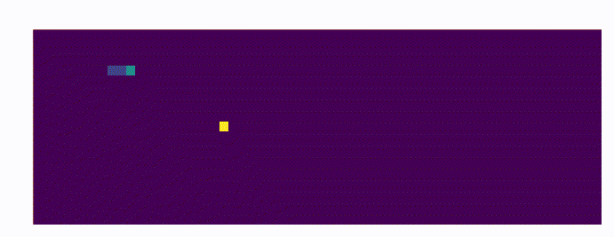

# Simple snake teaching attempt using Deep Reinforcement Learning



Attempt to teach neural network to play snake game using Deep Q Learning Implemenation in Keras and Gym.
Used Deep Q network can be found [https://github.com/keon/deep-q-learning](here) and the blog with
explanations [https://keon.io/rl/deep-q-learning-with-keras-and-gym/](https://keon.io/rl/deep-q-learning-with-keras-and-gym/)

To train the snake, type:

```
python dqn.py train
```

To play the trained snake, type:

```
python dqn.py play
```